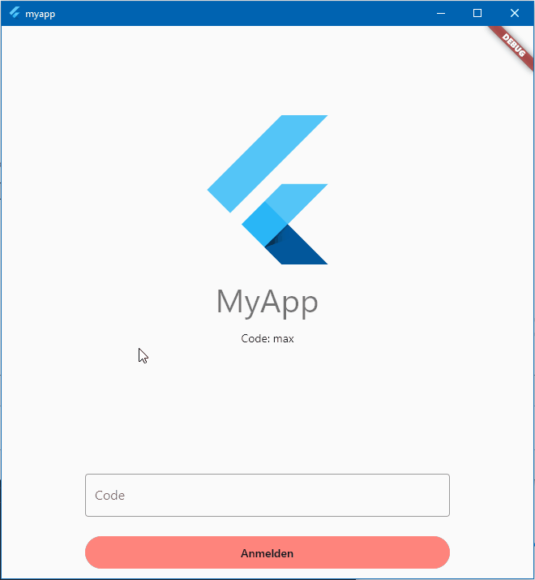
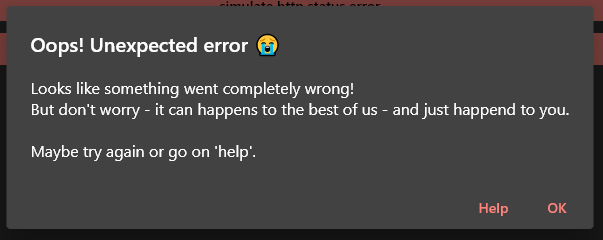
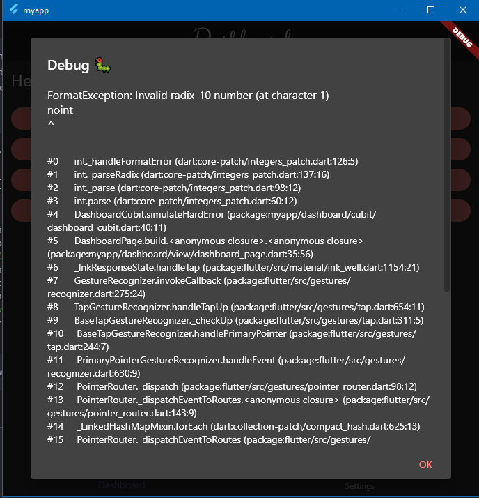

<h1 align="center">MyApp - Flutter template</h1>

<h3 align="center">Flutter project template for easy start</h3>
<p align="center">Just clone the project and build your app on top of it!!! <br /> With a lot of key concepts and features which almost each app needs.</p>
<p align="center"></p>
<p align="center"><a href="https://devtory-gbr.github.io/flutter-template/">Try live demo</a></p>
<br />

**SDK** | ✔️ Flutter

**Plattform** | ✔️ Android ✔️ IOS ✔️ Linux ✔️ MACOS ✔️ WEB ✔️ WINDOWS



_Table of Content_

- [👨‍💻 What's the project about?](#-whats-the-project-about)
- [🚀 Gettign started](#-gettign-started)
- [⭐ Key Concepts and Features](#-key-concepts-and-features)
- [📝 Authors](#-authors)
- [🙏 Credits](#-credits)
- [🧾 License](#-license)
- [🚫 Disclaimer](#-disclaimer)

## 👨‍💻 What's the project about?

It is a simple app wich showing a lot of key concepts like handling theming, internatinalizing, state management, store date, routing and more one.

Furthermore it is not the 1000. todo app which shows only 1 to 2 key concepts. It is a real app wich you can use for start 1:1, without any code removing and showing all on generic features which almost each good app needs like navigation, changing theme and language, about and licence page.

Mainly it is a collection of the top packages (in my oppinion), best practices and cool concepts from serveral tutorials, wrapped all up into one project that you can just start with designing and coding new views 😄.

All the packages are used based on compatibility for all plattforms, under a license for commercial usage, flutters favorite or from the flutter or dart team themeselves and of course a good documentation how to use it.

## 🚀 Gettign started

Just clone the project:

```
git clone https://github.com/Devtory-GbR/flutter-template.git
```

Install the packages

```
flutter pub get
```

Start the project

```
flutter run
```

**The following steps you may wanna change/adjust:**

- project name
  - name attr in pubspec.yaml
  - be aware afterthat all imports are wrong, just search an replace _'package:myapp_ with _'package:[PROJECTNAME]_
- app name and bundle identifier
  - you can just search for myapp again and replace it
  - otherwise the flutter documentation point out where to change the display and identifiert ([iOS](https://docs.flutter.dev/deployment/ios), [Android](https://docs.flutter.dev/deployment/android))
- [Theming](#theming)

That's all now just start to build your views.

🏁 Have FUN with Coding! 🏁

## ⭐ Key Concepts and Features

- [Environment](#environment) - dev, staging, prod
- [State management](#state-management) - with Flutter Bloc
- [Persistence for small data](#persistence-for-small-data) - with a key-value storage
- [Persistence for large data](#persistence-for-large-data) - local sqllite with drift
- [Logging](#logging) - even with storing localy for furture crash reports
- [API Requests](#api-requests) - via HTTP and concept for global header
- [Error Handling](#error-handling) - providing some helper classes to sow the error
- [Routing](#routing) - with real URLs for a web app
- [Internationalizing](#internationalizing) - changing by the user in the settings
- [Theming](#theming) - changing by the user in the settings
- [Form validation](#form-validation) - building efficent forms and handling the input
- [Authentication](#authentication) - complete login flow by using a lot of concepts
- [Licenses](#licences) - showing all used 3rd-Party Software and each license
- [App and device Info](#app-and-device-info) - always good for debug purpose and further crash reports
- [ListView Handling](#listview-handling) - some concepts for building nice lists in flutte with bloc pattern and animation
- [Lint and style guides](#lint-and-style-guides) - must have in each colloberate software project!

**What is missing?**

- Testing
  - Package from Flutter for testing is already added
  - but so far no test are written
  - consider that automated test's are quite need and flutter has a really nice testing framework even for ui
  - https://docs.flutter.dev/testing

### Environment<!-- omit in toc -->

You can run the app in different environment - dev, staging or prod.
During the startup you can then load specific global params over an env.json-File e.g. HTTP Url.

The specific environment is read during the starup from the startup param in the _main.dart_. And then during the bootstrap of the app the _env.json_ File in the root-Folder is loaded.

_main.dart_

```dart
// dev: flutter run
// staging: flutter run --dart-define=ENV=STAGING
// prod: flutter run --dart-define=ENV=PROD
const env = String.fromEnvironment('ENV', defaultValue: Environment.dev);
await Application(env: env).bootstrapApp();
```

_env.json_

```
{
  "CLIENT_URL": "https://api.myapp.com/v1/"
}
```

_exmaple_

```dart
// access params from the env file over Singleton Environment()
print(Environment().env['CLIENT_URL']);

// access the config instance
// there you can store hard codes params e.g. is dev/staging/prod
// which you dan't wanna editiable via .env
print(Environment().config.isDev);
```

_Note_: Usally we just use the package [flutter_dotenv](https://pub.dev/packages/flutter_dotenv) and load the config with a .env-File. But these ends up in some issues:

1. the programer believes that he can store sensitive informations like API-Key --> these could easily read in web or the app bundle
2. it need some extra configuration at the web server to allow to read a .env file

### State management<!-- omit in toc -->

📦 Packages:

- flutter_bloc (https://pub.dev/packages/flutter_bloc)

When building production quality applications, managing state becomes critical.

For Flutter you will find several approcheas and solutions - [here](https://docs.flutter.dev/data-and-backend/state-mgmt/options).

I prefere to use the BLoC pattern (by _Felix Angelov_).

You will find a excelent documentation and a lot of examples here: https://bloclibrary.dev/.

The pattern is used all over the app, you can see the usage for example by the theme, language and log view.

### Persistence for small data<!-- omit in toc -->

📦 Packages:

- shared_preferences (https://pub.dev/packages/shared_preferences)

If you have a relatively small collection of key-values to save locally.

An example can be found in the app in the settings. The infos of the choosen language or theme by the customer is stored locally on the disk - so that it can load during the next startup - see [settings_repository.dart](./packages\repositories\lib\src\settings\settings_repository.dart)

But even the token for the auth flow is stored. So that an the next startup of the app or reload the webstite --> the user is still logged in. [authentication_repository.dart](./packages/repositories/lib/src/authentication/authentication_repository.dart)

### Persistence for large data<!-- omit in toc -->

📦 Packages:

- drift (https://pub.dev/packages/drift)

A reactive library to store relational data in flutter applications.

**Important**: It works on all Plattforms.

A code exmaple using drift can find in the [log_repository.dart](./packages/repositories/lib/src/log/log_repository.dart)

After defining your table model or changing you have to re-generate some code. To do so you have to run the following code

```
dart run build_runner build

# for continues rebuild
dart run build_runner watch

#IMPORTANT you have to run it in the path \packages\repositories. There were you added int the pubspec.yaml the drift package
```

### Logging<!-- omit in toc -->

📦 Packages:

- logging (https://pub.dev/packages/logging)

Handle the logging at one point in the app, with different log levels.

So far the logs will store in a local database (logs will be deleted after some time), with the idea that maybe the user can send a crash report or other debugging purpose. Also in the debug mode it will all printed in the console.

In the _app.dart_ you can change the log level and change the behaviour:

```dart
// Setup the Logger
Logger.root.level = kDebugMode ? Level.ALL : Level.WARNING;
Logger.root.onRecord.listen(
  (LogRecord record) {
    if (kDebugMode) {
      print(
          '${record.time}[${record.level.name}] ${record.loggerName}: ${record.message}');
    }

    try {
      LoggerRepository.instance.addLog(
        name: record.loggerName,
        level: record.level.value,
        time: record.time,
        message: record.message,
        stackTrace: record.stackTrace,
      );
    } catch (e, stacktrace) {
      // At these point we don't wann log again
      // then we will run in an infinitie loop
      if (kDebugMode) {
        print(e);
        print(stacktrace);
      }
    }
  },
);
```

On the about page is the option to see the complete log.

### API Requests<!-- omit in toc -->

📦 Packages:

- http (https://pub.dev/packages/http)

A composable, multi-platform, Future-based API for HTTP requests.

Here we are not using [dio](https://pub.dev/packages/dio). These package use quite powerful but also quite heavy and not flutter favorite or from flutter themselves. It is made by the flutter cn community and now kinda the flutter cn branch.

A good example how the API Request works can be seen in the [auth repository](./packages/repositories/lib/src/authentication/repository.dart) and [authentication_api.dart](./packages/repositories/lib/src/authentication/api/authentication_api.dart).

Also so far a on low level HttpClient is setup for generic handling during the send process and buildung the URL - [http_client.dart](./packages/repositories/lib/src/http/http_client.dart). These is a good startpoint if you wanna add more advanced stuff, e.g. caching of network request.

The Http Client is so far also coming with an nice observer and globale CLIENT_URL from the environment - usage can be seen in the [app.dart](./lib/app.dart).

```
// Set up Http Client
MyAppHttpClient.clientURL = Environment().env['CLIENT_URL'] ?? '';
MyAppHttpClient.observer =
    AppHttpObserver(authenticationRepository: _authenticationRepository);

```

### Error Handling<!-- omit in toc -->

So far the app is implemented that each error ends up in the [app.dart](./lib/app.dart). You will find here a some Observers (BloC and Http) where you can handle Errors globally

e.g. automatic logout on a 401 HTTP Response in the HttpObserve:

```dart
class AppHttpObserver extends HttpObserver {
  final log = Logger('AppHttpObserver');

  final AuthenticationRepository _authenticationRepository;

  AppHttpObserver({required AuthenticationRepository authenticationRepository})
      : _authenticationRepository = authenticationRepository;

  @override
  void onSend(BaseRequest request) {
    super.onSend(request);
    log.fine('onSend -- ${request.url}');
  }

  @override
  void onHttpErrorResponse(BaseRequest request, int statusCode) {
    // At these point we just assume, then when the Http Response is 401
    // the auth token is no longe valid --> the we will globally log the user out
    // so that we don't have to check it for each request
    if (statusCode == 401) {
      _authenticationRepository.logOut();
    }
    super.onHttpErrorResponse(request, statusCode);
  }
}
```

or showing a nice dialog globally with a user friendly text and a debug view with stack trace

```dart
class AppBlocObserver extends BlocObserver {
  final log = Logger('AppBlocObserver');

  final GlobalKey<ScaffoldMessengerState> scaffoldKey;
  final GlobalKey<NavigatorState> navigatorKey;

  AppBlocObserver({required this.scaffoldKey, required this.navigatorKey});

  @override
  void onError(BlocBase bloc, Object error, StackTrace stackTrace) {
    log.severe('onError -- ${bloc.runtimeType}, $error', error, stackTrace);
    super.onError(bloc, error, stackTrace);

    // if the error is a http error with auth required,
    // we assume at these point that the token is no longer valid an logout
    // and redirect the user to the login page --> so we wanna show a snackbar so that
    // is is shown ofer the screens
    if (error is HttpException && error.statusCode == 401) {
      // you can show a snack bar
      if (scaffoldKey.currentContext != null) {
        scaffoldKey.currentState!
          ..hideCurrentSnackBar()
          ..showSnackBar(
            SnackBar(
              content: Text(AppLocalizations.of(scaffoldKey.currentContext!)!
                  .errorInvalidTokenAutoLogout),
            ),
          );
      }
      return;
    }

    // or maybe just a dialog
    if (navigatorKey.currentContext != null) {
      showErrorDialog(
          context: navigatorKey.currentContext!,
          error: error,
          stackTrace: stackTrace);
    }
  }
}
```




The key concept is, that mainly the erros will throw in the repository package during the network or database requests. The repositories call will be done by the BloC/Cubit.
So at the end they will catch these errors - the expected error (e.g. wrong credentials) will handle by the bloc themeselves. All other errors will forwarded to the BlocObserver to handle it globally.

LoginBloc - [login_bloc.dart](./lib/login/bloc/bloc/login_bloc.dart):

```dart
emit(state.copyWith(status: FormzSubmissionStatus.inProgress));
try {
  await _authenticationRepository.logIn(
    username: state.code.value,
    password: '',
  );
  emit(state.copyWith(status: FormzSubmissionStatus.success));
} on UserPasswordIncorrectException catch (_) {
  // Failure state will show an error on login page --> BloCListener
  emit(state.copyWith(status: FormzSubmissionStatus.failure));
} catch (e, stackTrace) {
  emit(state.copyWith(status: FormzSubmissionStatus.initial));
  // will trigger AppBlocObserver onError to handle showing the erro globally
  addError(e, stackTrace);
}
```

All other not catched errors will catched in the [app.dart](./lib/app.dart) and so far logged in the console and stored in the db:

```dart
// Log global errors caught by flutter
FlutterError.onError = (FlutterErrorDetails details) {
  FlutterError.presentError(details);
  Logger('FlutterError').shout(details, details, details.stack);
};

// Log gloable erros not caught by flutter
PlatformDispatcher.instance.onError = (error, stack) {
  Logger('PlatformDispatcher').shout(error, error, stack);
  if (kDebugMode) {
    return false;
  } else {
    return true;
  }
};
```

### Routing<!-- omit in toc -->

📦 Packages:

- go_router (https://pub.dev/packages/go_router)

A routing package built on top of Router and Navigator's pages API, supporting arbitrary nested navigation, guards and more.

It is setup in the app for even full native web url support, even with guards for the login flow and a nice init screen at the beginning if you need some init heavy loading stuff.

Just add your own routes or guards in the [routes.dart](./lib/routes.dart).

### Internationalizing<!-- omit in toc -->

📦 Packages:

- flutter_localizations (https://pub.dev/packages/flutter_localization)
- intl (https://pub.dev/packages/intl)

The hole App is unsing text from a translation file. So you can easily add new strings and translate the app in every language you want.

A full documentation how it is setup can be found [here](https://docs.flutter.dev/accessibility-and-localization/internationalization), thx to the flutter dev team.

Just put all you translations in _\lib\l10n_.

If you add new strings or complete new language with a new .arb-File run the app again.

Changing the language itself by the user is implemented in the settings section. The views and the logic can be found in [lib\settings\settings.dart](./lib/settingssettings.dart)

The list of all available languges is defined over the supported languages based on the \*.arb-Files. The option for the system language is defined in the [locale_cubit.dart](./lib/settings/cubit/locale_cubit.dart)

```dart
static final systemLocale = AppLocale(
      key: 'system',
      desc: 'systemLanuage',
      locale: Locale(
        Platform.localeName.substring(0, 2),
      ));

static final Map<String, AppLocale> locales = {
  'system': systemLocale,
  for (var locale in AppLocalizations.supportedLocales)
    locale.languageCode.substring(0, 2): AppLocale(
        key: locale.languageCode.substring(0, 2),
        desc: locale.languageCode.substring(0, 2),
        locale: locale)
};
```

Usage

```dart
import 'package:flutter_gen/gen_l10n/app_localizations.dart';


Text(AppLocalizations.of(context)!.title);

```

When making changes just run the follwing command an the file _app_localizations.dart_ will re-generated:

```
flutter gen-l10n
```

### Theming<!-- omit in toc -->

The themes and colors are defined in [lib\styles\colors.dart](./lib/styles/colors.dart) and [lib\styles\themes.dart](./lib/styles/themes.dart).

In the [colors.dart](./lib/styles/colors.dart) file, you will notice that except from the primary and accent color a custom color palette is defined. Moreover you will find each definition for a light and a dark theme. And a static _of_ method to get the correct color at runtime depending on the current brightness of the theme:

e.g. [log_page.dart](./lib/log/view/log_page.dart):

```dart
Container(
  padding:
      const EdgeInsets.symmetric(horizontal: 12.0, vertical: 4.0),
  decoration: BoxDecoration(
      color: getLevelColor(item.level, context),
      borderRadius: const BorderRadius.all(Radius.circular(8.0))),
  child: Row(
    mainAxisSize: MainAxisSize.min,
    children: [
      Text(
        getLevelText(item.level),
        style: Theme.of(context).textTheme.labelMedium!.copyWith(
            color: getLevelColor(item.level, context).textColor),
      ),
    ],
  ),
),
[...]
CustomColor getLevelColor(int level, BuildContext context) {
  if (level <= Level.FINE.value) {
    return AppColors.of(context).fineColor;
  } else if (level <= Level.CONFIG.value) {
    return AppColors.of(context).debugColor;
  } else if (level <= Level.INFO.value) {
    return AppColors.of(context).infoColor;
  } else if (level <= Level.WARNING.value) {
    return AppColors.of(context).warningColor;
  } else if (level <= Level.SEVERE.value) {
    return AppColors.of(context).errorColor;
  } else if (level <= Level.SHOUT.value) {
    return AppColors.of(context).criticalColor;
  } else {
    return AppColors.of(context).debugColor;
  }
}
```

Feel free to just adjust it or add complete new themes. That the user can choose your theme, don't forget it to add it in the [theme_cubit.dart](./lib/settings/cubit/theme_cubit.dart):

```dart
static final Map<String, AppTheme> themes = {
  'primary':
      AppTheme(key: 'primary', desc: 'light', theme: AppThemes.primary),
  'primaryDark': AppTheme(
      key: 'primaryDark', desc: 'dark', theme: AppThemes.primaryDarkTheme)
};
```

Changing the theme itself by the user is implemented in the settings section. The views and the logic can be found in [lib\settings\settings.dart](./lib/settingssettings.dart)

### Form validation<!-- omit in toc -->

📦 Packages:

- formz (https://pub.dev/packages/formz)

A good concept to seperate the representation of form and all the logic like validation and status of the form in a generic way. The best - it works fine with the bloc pattern and a good example can be seen in the login section. ([login views and bloc](./lib/login/login.dart))

### Authentication<!-- omit in toc -->

A dummy authentication flow is implemented in the bloc pattern.

The base is mainly inspired by the following tutorial:
https://bloclibrary.dev/#/flutterlogintutorial

Here you can find the code in he project:

- [authentication_bloc.dart](./lib/authentication/authentication.dart)
- [login views and bloc](./lib/login/login.dart)
- [auth repository](./packages/repositories/lib/src/authentication/repository.dart)
- [user repository](./packages/repositories/lib/src/user/repository.dart)

But not only just simple views are implemented, furthermore the auth flow is full designed:

- storing the token locally
- loading and checking the token on next startup
- guards and redirecting if the tken is invalid
- setting the token to the http-client for requests
- loading userdata depending on the auth state
- checking each http request if the token is invalid and logout

### Licenses<!-- omit in toc -->

Showing the licenses is working out of the box with flutter:
https://api.flutter.dev/flutter/material/showLicensePage.html

Thise is implemented in the about page

```dart
ListTile(
  leading: const Icon(Icons.document_scanner),
  title: Text(AppLocalizations.of(context)!.license),
  onTap: () async {
    showLicensePage(context: context);
  },
),
```

Keep in mind, when using other assets e.g. fonts to add also the license to the registry.

A example can found in the _app.dart_:

```dart
LicenseRegistry.addLicense(() async* {
  final license =
      await rootBundle.loadString('fonts/clicker-script/OFL.txt');
  yield LicenseEntryWithLineBreaks(['ClickerScript'], license);
});
```

### App and device info<!-- omit in toc -->

📦 Packages:

- package_info_plus (https://pub.dev/packages/package_info_plus)
- device_info_plus (https://pub.dev/packages/device_info_plus)

It could ab always convenient to show somewhere the app verions/name/build and also soem device info - specific when you plan to support multiple systems. So the user themeselve can give these informattions easily when report an issue or you can just collect it automaticly.

On the about screen you can find the packages in action.

### ListView Handling<!-- omit in toc -->

Under Construction, example can see in the logging page.

### Lint and style guides<!-- omit in toc -->

📦 Packages:

- flutter_lints (https://pub.dev/packages/flutter_lints)

Get a nice structure of the code and when working with vscode you can even format the code on save.

For the project the recommended settings for flutter projects are used. But you can edit it in the [analysis_options.yaml](./analysis_options.yaml)

## 📝 Authors

- [Martin Weber](https://github.com/ThunderAnimal)

## 🙏 Credits

Thx to all contributers to the open source packages we used here. In future we will provide a nice list here for special thx to some people!

## 🧾 License

See the [LICENSE](./LICENSE) file for licensing information.

## 🚫 Disclaimer

YOUR ARE FREE TO USE THE CODE IN YOUR PROJECTS HOWEVER MAKE CLEAR THAT THE CODE IS OFFERED "AS-IS, WITHOUT WARRANTY AND DISCLAIMING LIABILITY FOR DAMAGES RESULTING FROM USING THE CODE.
